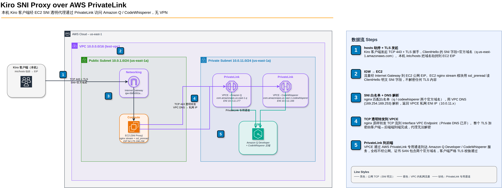

# Kiro SNI Proxy over AWS PrivateLink 方案文档

> 📅 2026-04-26 · 作者：王骁

**版本**：v1.0
**状态**：✅ 已部署验证通过

---

## 1. 背景与目标

### 1.1 背景

Kiro 客户端底层依赖 Amazon Q Developer / CodeWhisperer 服务，这些服务的 API 端点部署在海外 AWS Region。企业在中国的团队成员由于网络环境限制，直连海外端点不稳定甚至不可达，需要通过一个固定的海外出口 IP 来稳定访问 Kiro 服务。

### 1.2 目标

- 为中国团队提供稳定的海外出口 IP，确保 Kiro 正常可用
- **不使用** Site-to-Site VPN、Client VPN、SD-WAN 等传统方案
- **不改造** Kiro 客户端本身（不破坏 TLS、不改源码）
- 支持 40 人团队并发使用
- 员工在**公司网络**和**个人家庭网络**下都可使用（无需额外 VPN）

---

## 2. 方案架构

### 2.1 整体拓扑



---

## 3. 已部署资源清单

**账号**：<ACCOUNT_ID> | **Region**：us-east-1

### 3.1 新建资源

| 类型 | ID | 用途 |
|------|------|------|
| EC2 | `<EC2_INSTANCE_ID>` | SNI 代理服务器 (**c6g.large**, Ubuntu 24.04 arm64) |
| EIP | `<EIP>` (<EIP_ALLOC_ID>) | 固定公网 IP |
| Security Group | `<EC2_SG_ID>` | 入站：443 全开（待收紧）、22 限制 <ADMIN_SSH_IP>/32 |

### 3.2 复用现有资源

| 类型 | ID | 说明 |
|------|------|------|
| VPC | `<VPC_ID>` (test-vpc, 10.0.0.0/16) | 已有公私分离架构 |
| Public Subnet | `<PUBLIC_SUBNET_ID>` (10.0.1.0/24, us-east-1a) | EC2 所在 |
| IGW | `<IGW_ID>` | |
| Public RT | `<PUBLIC_RT_ID>` | 已关联 public subnet |
| VPCE - q | `<VPCE_Q_ID>` | Private DNS 已开 |
| VPCE - codewhisperer | `<VPCE_CODEWHISPERER_ID>` | Private DNS 已开 |
| Endpoint SG | `<VPCE_SG_ID>` | 已允许 10.0.0.0/16 访问 443 |

---

## 4. EC2 配置详解

### 4.1 操作系统

- **OS**：Ubuntu 24.04 LTS (Noble Numbat)
- **架构**：arm64 (Graviton c6g.large)
- **AMI**：`<AMI_ID>`
- **IMDSv2**：强制

### 4.2 已装软件

```bash
apt-get install -y nginx libnginx-mod-stream dnsutils
```

### 4.3 nginx 配置 `/etc/nginx/nginx.conf`

```nginx
user www-data;
worker_processes auto;
worker_rlimit_nofile 65535;
pid /run/nginx.pid;
include /etc/nginx/modules-enabled/*.conf;  # 关键：加载 stream 模块

events {
    worker_connections 16384;
    multi_accept on;
    use epoll;
}

stream {
    # SNI 白名单：只转发 Kiro 相关域名
    map $ssl_preread_server_name $backend {
        codewhisperer.us-east-1.amazonaws.com  $ssl_preread_server_name:443;
        q.us-east-1.amazonaws.com              $ssl_preread_server_name:443;
        default                                "";   # 其他域名直接拒绝
    }

    # VPC DNS：解析 Kiro 域名 → VPCE 私网 IP（走 PrivateLink 核心）
    resolver 169.254.169.253 valid=30s ipv6=off;
    resolver_timeout 5s;

    # 连接级日志（每个 TCP 连接关闭时写一条）
    log_format sni '$remote_addr [$time_local] sni="$ssl_preread_server_name" '
                   'backend="$backend" status=$status sent=$bytes_sent recv=$bytes_received '
                   'duration=$session_time';
    access_log /var/log/nginx/sni.log sni buffer=64k flush=5s;
    error_log  /var/log/nginx/sni_error.log warn;

    tcp_nodelay on;

    server {
        listen 443 reuseport;            # reuseport 关键优化：多核并行 accept
        proxy_pass $backend;
        ssl_preread on;
        proxy_connect_timeout 10s;
        proxy_timeout 600s;
        proxy_socket_keepalive on;
    }
}

http {
    server {
        listen 80 default_server;
        return 404;   # 不开 HTTP 服务
    }
}
```

---

## 5. 客户端配置（本机）

### 5.1 修改 hosts

**macOS / Linux**：

```bash
sudo tee -a /etc/hosts <<EOF
<EIP>  codewhisperer.us-east-1.amazonaws.com
<EIP>  q.us-east-1.amazonaws.com
EOF

# macOS 清 DNS 缓存
sudo dscacheutil -flushcache && sudo killall -HUP mDNSResponder
```

**Windows**（管理员）：
编辑 `C:\Windows\System32\drivers\etc\hosts` 添加：

```
<EIP>  codewhisperer.us-east-1.amazonaws.com
<EIP>  q.us-east-1.amazonaws.com
```

然后 `ipconfig /flushdns`

### 5.2 验证 hosts 生效

```bash
# ✅ 正确方式（读 hosts）
getent hosts codewhisperer.us-east-1.amazonaws.com
# 应输出：<EIP>  codewhisperer.us-east-1.amazonaws.com

# ✅ 或用 curl
curl -v https://codewhisperer.us-east-1.amazonaws.com/ 2>&1 | grep Connected
# 应输出：Connected to codewhisperer.us-east-1.amazonaws.com (<EIP>)

# ❌ 错误方式：dig 不读 hosts！
# dig 会直接查 DNS 服务器，结果不代表实际流量去向
```

---

## 6. 验证流程

### Step 1：Kiro 实际工作

本机打开 Kiro，登录并发送一条消息 → 正常对话即成功。

### Step 2：服务端日志确认

```bash
# EC2 上
aws ssm start-session --target <EC2_INSTANCE_ID>
sudo tail -f /var/log/nginx/sni.log
```

应看到你本机 IP 的请求，形如：

```
<你的IP> [时间] sni="q.us-east-1.amazonaws.com" backend="q.us-east-1.amazonaws.com:443" status=200 sent=11080 recv=2195 duration=61.6
```

### Step 3：反证（最硬证据）

停掉代理，Kiro 必然挂：

```bash
# 停
aws ssm send-command --region us-east-1 --instance-ids <EC2_INSTANCE_ID> \
  --document-name "AWS-RunShellScript" \
  --parameters 'commands=["systemctl stop nginx"]'

# 此时 Kiro 发消息会 timeout

# 恢复
aws ssm send-command --region us-east-1 --instance-ids <EC2_INSTANCE_ID> \
  --document-name "AWS-RunShellScript" \
  --parameters 'commands=["systemctl start nginx"]'
```

---

## 7. 成本估算

### 7.1 完整月成本（40 人团队，us-east-1）

| 项目 | 规格 | 单价 | 月成本 |
|------|------|------|--------|
| EC2 c6g.large | 2vCPU 4GB Graviton2 on-demand | \$0.068/h | \$49.64 |
| EBS gp3 | 8 GB | \$0.08/GB·月 | \$0.64 |
| EIP（绑定中） | 1 个（2024-02 起收费） | \$0.005/h | \$3.65 |
| VPCE - q | Interface Endpoint × 1 AZ | \$0.01/h/AZ | \$7.30 |
| VPCE - codewhisperer | Interface Endpoint × 1 AZ | \$0.01/h/AZ | \$7.30 |
| VPCE 数据处理 | 前 1 PB | \$0.01/GB | ~\$0.10 - \$1.00 |
| 流量（EIP 出站） | 预估 5-20 GB/月 | \$0.09/GB | ~\$0.45 - \$1.80 |
| **合计** | | | **≈ \$69 - \$71 / 月** |

### 7.2 关键成本说明

- **EIP**：2024-02-01 起 AWS 对所有 EIP 收费，不管是否绑定。无法避免。
- **VPCE 按 AZ 收费**：每个 Interface Endpoint 每 AZ \$0.01/h。当前两个 VPCE 都只在 us-east-1a，如果扩展到多 AZ（HA 场景）每多一个 AZ 再加 \$7.30。
- **数据处理费**：PrivateLink 每 GB \$0.01，Kiro 对话流量不大，40 人每月预估不超过 \$1。
- **VPCE 是固定成本**：不管有没有代理，只要 VPCE 存在就收钱。如果本来就在用 PrivateLink，这部分是沉没成本，代理方案没有额外增加。

---

## 8. 后续扩展方向

### 8.1 多域名支持

如果 Kiro 后续加新域名，在 nginx `map` 里加一行即可：

```nginx
map $ssl_preread_server_name $backend {
    codewhisperer.us-east-1.amazonaws.com  $ssl_preread_server_name:443;
    q.us-east-1.amazonaws.com              $ssl_preread_server_name:443;
    new-domain.amazonaws.com               $ssl_preread_server_name:443;  # 新增
    default                                "";
}
```

### 8.2 高可用

- EC2 换成 ASG + NLB（NLB 也支持 TCP 透传，和 SNI 代理配合无障碍）
- 成本翻倍，按需取舍

### 8.3 架构变体：无 PrivateLink 版

本方案 SNI 代理本身即可工作，**不强依赖 PrivateLink**。降级路径极简：只需**删除两个 VPCE**，nginx 配置零改动。

```bash
aws ec2 delete-vpc-endpoints --region us-east-1 \
  --vpc-endpoint-ids <VPCE_Q_ID> <VPCE_CODEWHISPERER_ID>
```

#### 为什么 nginx 不用改（关键机制）

理解这个机制需先说清楚 `resolver 169.254.169.253` 这个地址是什么。

**`169.254.169.253` 是 AWS VPC 内置 DNS 解析器**的固定地址（AWS 文档称为 *Amazon-provided DNS server* / *Route 53 Resolver*）：

- 属于 `169.254.0.0/16` link-local 段，只在 VPC 内部可访问
- 每个 VPC 自动拥有，无需配置
- 功能：同时应答两类查询
  1. **公网域名** → 转发到 AWS 公共 DNS，返回公网 IP
  2. **启用了 Private DNS 的 Interface VPCE 对应域名** → 返回 VPCE ENI 的私网 IP（这是 PrivateLink 的核心）
- `/etc/resolv.conf` 默认指向这里，EC2 所有域名解析默认走它

**行为对比**：对同一个域名 `q.us-east-1.amazonaws.com`，169.254.169.253 的返回值会随 VPCE 存不存在而变：

| VPCE 状态 | 169.254.169.253 返回 | nginx 实际连到 |
|-----------|---------------------|---------------|
| 存在（Private DNS on） | `10.0.11.177`（VPCE 私网 IP） | AWS 骨干网 |
| **已删除** | **`98.84.x.x / 34.199.x.x / 100.52.x.x` 等**（Kiro 真实公网 IP） | 公网 |

这就是为什么删 VPCE 后 nginx 配置无需修改：**VPC DNS 失去 Private DNS 记录后自动回落到公网解析**，resolver 拿到的就是官方公网 IP，nginx 透传逻辑不感知这个变化。

> 极少数场景你可能想强制走公网 DNS（如调试），可把 resolver 改成 `8.8.8.8` 或 `1.1.1.1`。但常规降级不需要，保留 `169.254.169.253` 反而更健壮（不依赖外部 DNS 可用性，且保留将来重新开启 PrivateLink 的能力）。

#### 对比

| 维度 | 有 PrivateLink | 无 PrivateLink（仅删 VPCE） |
|------|---------------|---------------------------|
| 月成本 | ~\$70 | **~\$55**（省 2 个 VPCE \$14.60） |
| nginx 配置改动 | — | **0 行** |
| 数据路径 | EC2 → VPCE → AWS 骨干网 → Kiro | EC2 → 公网 → Kiro |
| 后端证书 CN | `*.codewhisperer.us-east-1.vpce.amazonaws.com` | `q.us-east-1.amazonaws.com`（Kiro 真实证书） |
| 合规（PCI / HIPAA / 企业内网安全） | ✅ 强 | ⚠️ 弱（数据绕公网） |
| 延迟 | 略低 | 略高（1-5 ms） |
| 架构复杂度 | 2 个 VPCE + Private DNS | 无 VPCE |
| 客户端行为 | 无差别 | 无差别 |
| SNI 白名单、日志、TLS 透传 | ✅ 保留 | ✅ 保留 |

#### 适用场景建议

- **选 PrivateLink**：金融 / 医疗 / 企业合规严格场景、已有 PrivateLink 预算、客户方案演示；PrivateLink 的价值是「数据不离开 AWS 骨干网」，这是合规价值，不是技术价值。
- **选无 PrivateLink**：个人 / 小团队 / 仅为统一出口 IP 审计，对内网严格隔离无硬性需求；每月省 ~\$15，架构更简洁。

已通过对照实验验证：删除两个 VPCE 后 nginx 无需重启 / 重载，当前正常连接的客户端无感切换到公网路径。

---

## 9. 方案局限

| 局限 | 影响 | 缓解建议 |
|------|------|----------|
| 单点故障（EC2） | nginx 挂了 Kiro 就断 | EC2 换成 ASG + NLB（NLB 支持 TCP 透传，和 SNI 代理无障碍） |
| **单 AZ 部署风险** | 当前 VPCE 和 EC2 都在 us-east-1a。AZ 级故障时整套失效 | **生产建议至少 2 AZ**：VPCE 各加一个子网 + EC2 在另一 AZ 起一台 + NLB 平衡 |
| EC2 维护 | 需打补丁、升级 nginx | SSM Patch Manager 自动化 |
| 单 Region | 只支持 us-east-1 | 按 region 部署多套，hosts 分别指向 |
| 不加密控制面 | SNI 明文，理论上能看到访问哪个域名（但内容仍加密） | 可接受；如需进一步隐蔽可考虑 Outbound Resolver + Resolver Endpoint |
| 依赖 VPCE Private DNS | 关掉 DNS 方案失效 | 配置 lock + IAM 保护 |

---

## 10. 参考资料

- [AWS PrivateLink for Amazon Q Developer](https://docs.aws.amazon.com/amazonq/latest/qdeveloper-ug/vpc-endpoints.html)
- [Kiro and interface endpoints (AWS PrivateLink)](https://kiro.dev/docs/privacy-and-security/vpc-endpoints/)
- [nginx stream_ssl_preread_module](https://nginx.org/en/docs/stream/ngx_stream_ssl_preread_module.html)
- [TLS SNI 扩展 (RFC 6066)](https://www.rfc-editor.org/rfc/rfc6066#section-3)
